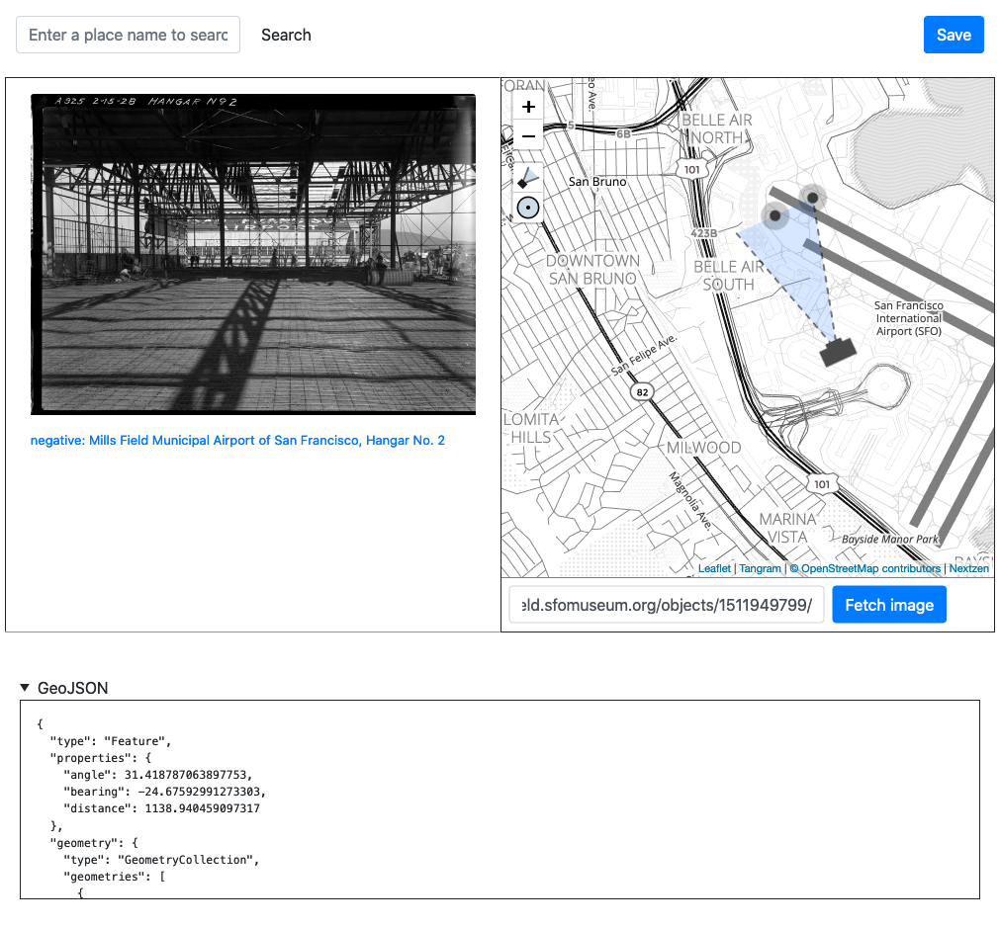

# go-www-geotag



A web application, written in Go, for geotagging images.

## Important

This is work in progress, including the documentation. In the meantime please have a look at the [Geotagging at SFO Museum](https://millsfield.sfomuseum.org/blog/tags/geotagging) series of blog posts.

## Tools

### server

```
$> ./bin/server -h
  -crumb-uri string
    	A valid aaronland/go-http-crumb.Crumb URI for generating (CSRF) crumbs. If the value is 'auto' then a random crumb URI will be generated. (default "auto")
  -disable-writer-crumb
    	Do not require a valid CSRF crumb for all writes.
  -enable-editor
    	Enable the geotagging editor interface. (default true)
  -enable-map-layers
    	Enable use of the leaflet-layers-control Leaflet control element for custom custom map overlays.
  -enable-oembed
    	Enable oEmbed lookups for images.
  -enable-placeholder
    	Enable use of the Placeholder API for location searches.
  -enable-proxy-tiles
    	Enable the use of a local tile proxy for Nextzen map tiles.
  -enable-writer
    	Enable output of the leaflet-geotag plugin to be written to a go-www-geotag/writer.Writer instance.
  -enable-writer-cors
    	Enable CORS support for the writer endpoint.
  -initial-latitude float
    	A valid latitude for the map's initial view. (default 37.61799)
  -initial-longitude float
    	A valid longitude for the map's initial view. (default -122.370943)
  -initial-zoom int
    	A valid zoom level for the map's initial view. (default 14)
  -map-renderer string
    	Valid options are: protomaps, tangramjs (default "tangramjs")
  -nextzen-apikey string
    	A valid Nextzen API key
  -nextzen-style-url string
    	A valid URL for loading a Tangram.js style bundle. (default "/tangram/refill-style.zip")
  -nextzen-tile-url string
    	A valid Nextzen tile URL template for loading map tiles. (default "https://{s}.tile.nextzen.org/tilezen/vector/v1/512/all/{z}/{x}/{y}.mvt")
  -oembed-endpoints string
    	A comma-separated list of valid oEmbed endpoints to query.
  -path-editor string
    	A relative path for the geotag editor application. (default "/")
  -path-proxy-tiles string
    	The URL (a relative path) for proxied tiles. (default "/tiles/")
  -path-writer string
    	A relative path for sending write updates. (default "/update")
  -placeholder-endpoint string
    	A valid Placeholder API endpoint to query.
  -protomaps-tile-url string
    	A valid Protomaps tile URL for loading map tiles.
  -protomaps-tiles-path string
    	The leading prefix for Protomap tile URLs. (default "/pmtiles/")
  -proxy-tiles-cache-uri string
    	A valid tile proxy DSN string. (default "gocache://")
  -proxy-tiles-test
    	Ensure outbound network connectivity for proxy tiles
  -proxy-tiles-timeout int
    	The maximum number of seconds to allow for fetching a tile from the proxy. (default 30)
  -server-uri string
    	A valid aaronland/go-http-server.Server URI for creating an application server. (default "http://localhost:8080")
  -writer-cors-allowed-origins string
    	A comma-separated list of origins to allow for CORS support. (default "*")
  -writer-uri string
    	A valid go-www-geotag/writer.Writer URI for creating a writer.Writer instance. (default "stdout://")
```

## See also

* https://github.com/sfomuseum/go-http-leaflet-geotag
* https://github.com/sfomuseum/go-http-protomaps
* https://github.com/nypl-spacetime/Leaflet.GeotagPhoto
* https://github.com/aaronland/go-http-tangramjs
* https://github.com/aaronland/go-http-leaflet
* https://github.com/aaronland/go-http-bootstrap