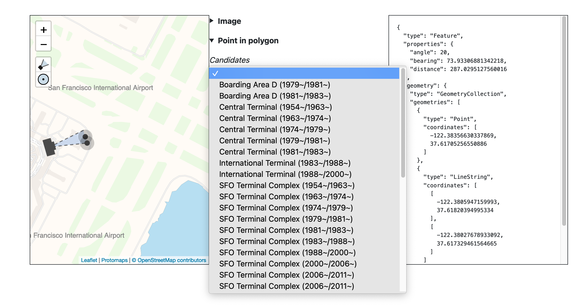
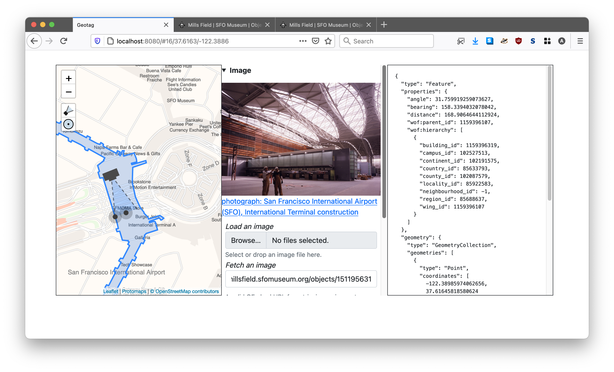

# go-www-geotag


A web application, written in Go, for geotagging images.

## Important

This is work in progress, documentation is incomplete.

## Background

Have a look at the [Geotagging at SFO Museum](https://millsfield.sfomuseum.org/blog/tags/geotagging) series of blog posts.
 
## Tools

```
$> make cli
go build -mod vendor -o bin/server cmd/server/main.go
```

### server

```
$> ./bin/server -h
  -crumb-uri string
    	A valid aaronland/go-http-crumb.Crumb URI for generating (CSRF) crumbs. If the value is 'auto' then a random crumb URI will be generated. (default "auto")
  -custom-placetypes string
    	A JSON-encoded string containing custom placetypes defined using the syntax described in the whosonfirst/go-whosonfirst-placetypes repository.
  -disable-writer-crumb
    	Do not require a valid CSRF crumb for all writes.
  -enable-custom-placetypes
    	Enable wof:placetype values that are not explicitly defined in the whosonfirst/go-whosonfirst-placetypes repository.
  -enable-editor
    	Enable the geotagging editor interface. (default true)
  -enable-map-layers
    	Enable use of the leaflet-layers-control Leaflet control element for custom custom map overlays.
  -enable-oembed
    	Enable oEmbed lookups for images.
  -enable-placeholder
    	Enable use of the Placeholder API for location searches.
  -enable-point-in-polygon
    	Enable point-in-polygon lookups for results.
  -enable-proxy-tiles
    	Enable the use of a local tile proxy for Nextzen map tiles.
  -enable-writer
    	Enable output of the leaflet-geotag plugin to be written to a go-www-geotag/writer.Writer instance.
  -enable-writer-cors
    	Enable CORS support for the writer endpoint.
  -initial-latitude float
    	A valid latitude for the map's initial view. (default 37.61799)
  -initial-longitude float
    	A valid longitude for the map's initial view. (default -122.370943)
  -initial-zoom int
    	A valid zoom level for the map's initial view. (default 15)
  -is-wof
    	Input data is WOF-flavoured GeoJSON. (Pass a value of '0' or 'false' if you need to index non-WOF documents. (default true)
  -iterator-uri string
    	A valid whosonfirst/go-whosonfirst-iterate/emitter URI. Supported schemes are: directory://, featurecollection://, file://, filelist://, geojsonl://, repo://. (default "repo://")
  -map-renderer string
    	Valid options are: protomaps, tangramjs (default "tangramjs")
  -nextzen-apikey string
    	A valid Nextzen API key
  -nextzen-style-url string
    	A valid URL for loading a Tangram.js style bundle. (default "/tangram/refill-style.zip")
  -nextzen-tile-url string
    	A valid Nextzen tile URL template for loading map tiles. (default "https://{s}.tile.nextzen.org/tilezen/vector/v1/512/all/{z}/{x}/{y}.mvt")
  -oembed-endpoints string
    	A comma-separated list of valid oEmbed endpoints to query.
  -path-editor string
    	A relative path for the geotag editor application. (default "/")
  -path-point-in-polygon string
    	The URI for point-in-polygon API requests. (default "/point-in-polygon/")
  -path-point-in-polygon-data string
    	The URI for point-in-polygon data requests. (default "/point-in-polygon/data/")
  -path-proxy-tiles string
    	The URL (a relative path) for proxied tiles. (default "/tiles/")
  -path-writer string
    	A relative path for sending write updates. (default "/update")
  -placeholder-endpoint string
    	A valid Placeholder API endpoint to query.
  -properties-reader-uri string
    	A valid whosonfirst/go-reader.Reader URI. Available options are: [file:// fs:// null://]
  -protomaps-tile-url string
    	A valid Protomaps tile URL for loading map tiles.
  -protomaps-tiles-path string
    	The leading prefix for Protomap tile URLs. (default "/pmtiles/")
  -proxy-tiles-cache-uri string
    	A valid tile proxy DSN string. (default "gocache://")
  -proxy-tiles-test
    	Ensure outbound network connectivity for proxy tiles
  -proxy-tiles-timeout int
    	The maximum number of seconds to allow for fetching a tile from the proxy. (default 30)
  -server-uri string
    	A valid aaronland/go-http-server.Server URI for creating an application server. (default "http://localhost:8080")
  -spatial-database-uri string
    	A valid whosonfirst/go-whosonfirst-spatial/data.SpatialDatabase URI. options are: [sqlite://]
  -verbose
    	Be chatty.
  -writer-cors-allowed-origins string
    	A comma-separated list of origins to allow for CORS support. (default "*")
  -writer-uri string
    	A valid go-www-geotag/writer.Writer URI for creating a writer.Writer instance OR 'exif://' which will enable embedding focal point but not field-of-view geotagging information as EXIF properties in a downloadable JPEG representation of an image. (default "stdout://")	
```

For example:

```
$> bin/server \
	-map-renderer protomaps \
	-protomaps-tile-url file:///usr/local/data/pmtiles/sfo.pmtiles \
	-enable-point-in-polygon \
	-spatial-database-uri 'sqlite://?dsn=/usr/local/data/sfomuseum-architecture.db'
	
2021/04/28 13:14:41 Listening on http://localhost:8080
```

If you visit `http://localhost:8080` in your web browser you'll see something like this:



In this configuration the `server` application a simple three-pane interface for geotagging images.

* The left-hand panel contains a map and a `Leaflet.GeotagPhoto` camera for defining a focal point and field of view.

* The middle panel contains controls for loading images and for filtering and selecting reverse-geocoding results (that are updated as the camera's focal point changes).

* The right-hand panels contains GeoJSON `Feature` data containing information about the camera's focal point and field of view as well as any reverse-geocoding data, if present, encoded in the `wof:parent_id` and `wof:hierarchy` properties. 

The `server` application as configured has a limited set of ways to publish data outside of copy-pasting the raw GeoJSON data in to another document. That will be addressed in subsequent examples.

_Related: [Geotagging at SFO Museum, Part 3 – What Is the Simplest Thing?](https://millsfield.sfomuseum.org/blog/2020/04/27/geotagging-simple/), [Geotagging at SFO Museum, Part 6 – Writers](https://millsfield.sfomuseum.org/blog/2020/04/30/geotagging-writers/), [Geotagging at SFO Museum, Part 7 – Custom Writers](https://millsfield.sfomuseum.org/blog/2020/05/01/geotagging-custom-writers/) and [Geotagging at SFO Museum, part 9 – Publishing Data](https://millsfield.sfomuseum.org/blog/2020/05/07/geotagging-publishing/)._

Walking through the parameters step-by-step the first being defined is the toolchain for rendering map tiles. In this example we're using [Protomaps.js](https://github.com/protomaps/protomaps.js) which renders maps tiles using a single "PMTiles" database file, specified in the `-protomaps-tile-url` flag, which can be hosted locally or on a remote file-server.

```
	-map-renderer protomaps \
	-protomaps-tile-url file:///usr/local/data/pmtiles/sfo.pmtiles \
```

_Related: [Protomaps: A new way to make maps with OpenStreetMap](https://protomaps.com/blog/new-way-to-make-maps/). To make your Protomaps database files try the [Protomaps bundle/download tool](https://protomaps.com/bundles)._

By default the application includes a [file attachment control](https://github.com/github/file-attachment-element) to load local images by dragging-and-dropping them on the application or using the operating system's file browser. A scaled down thumbnail of the image will be displayed in the center panel:


It is also possible to load remote images using the application's support for OEmbed endpoings. To enable that support you need to include the `-enable` and `-oembed-endpoints`. For example:

```
	-enable-oembed \
	-oembed-endpoints 'https://millsfield.sfomuseum.org/oembed/?url={url}&format=json' \
```

Once enabled the application will display an OEmbed control beneath the default local file control:



_Related: [Geotagging at SFO Museum, Part 5 – Images](https://millsfield.sfomuseum.org/blog/2020/04/29/geotagging-images/)_

The final set of flags enable "reverse geocoding" (sometimes called "point-in-polygon") lookups whenever you move the camera's focal point. These lookups are performed using the [go-whosonfirst-spatial](https://github.com/whosonfirst/go-whosonfirst-spatial) packages reading data stored in a SQLite database, specified by the `-spatial-database-uri`. flag

```
	-enable-point-in-polygon \
	-spatial-database-uri 'sqlite://?dsn=/usr/local/data/sfomuseum-architecture.db'
```

The SQLite databases are created using the `wof-sqlite-index-features` tool in the [go-whosonfirst-sqlite-features-index](https://github.com/whosonfirst/go-whosonfirst-sqlite-features-index) package, reading data from one or more Who's On First style repositories of data. For examples, this is how the `sfomuseum-architecture.db` database would be created reading data from the [sfomuseum-data-architecture](https://github.com/sfomuseum-data/sfomuseum-data-architecture) repository:

```
$> ./bin/wof-sqlite-index-features \
	-all \
	-dsn /usr/local/data/sfomuseum-architecture.db \
	/usr/local/data/sfomuseum-data-architecture/
	
2021/04/22 12:49:41 time to index paths (1) 2.702893585s
```

_Related: [Reverse-Geocoding in Time at SFO Museum](https://millsfield.sfomuseum.org/blog/2021/03/26/spatial/)_

Here's another example:

```
$> bin/server \
	-map-renderer tangramjs \
	-nextzen-apikey {NEXTZEN_APIKEY} \
	-enable-oembed \
	-oembed-endpoints 'https://millsfield.sfomuseum.org/oembed/?url={url}&format=json' \
	-enable-point-in-polygon \
	-spatial-database-uri 'sqlite://?dsn=/usr/local/data/sfomuseum-architecture.db' \
	-enable-placeholder \
	-placeholder-endpoint http://localhost:3000
```

Visiting `http://localhost:8080` in your web browser, you'll see something like this:


There are two important differences in the left-hand panel containing the map. The first is that the map tiles look different. That's because we are using the [Tangram.js](https://github.com/tangrams/tangram) library to render the map. The map data itself is provided by the [Nextzen](https://nextzen.org) project while provides global coverage.

```
	-map-renderer tangramjs \
	-nextzen-apikey {NEXTZEN_APIKEY} \
```

Enabling the use of maps using Tangram and Nextzen is done using the `-map-renderer` and `-nextzen-apikey` flags respectively. In order to use Nextzen tiles you'll need to provide a valid Nextzen developer API key which can be registered at [https://developers.nextzen.org/](https://developers.nextzen.org/).

_Related: [Maps (and map tiles) at SFO Museum](https://millsfield.sfomuseum.org/blog/2018/07/31/maps/) and [More recent old maps (and the shapes in the details)](https://millsfield.sfomuseum.org/blog/2019/11/06/maps/)._

The second difference is that the map has a search box in the upper right-hand corner.

```
	-enable-placeholder \
	-placeholder-endpoint http://localhost:3000
```

Searching for places, also called "geocoding", is assumed to be handled by the [Placeholder](https://github.com/pelias/placeholder) search engine. In future releases other search engines may also be supported. You'll need to set up and run the Placeholder service separately.

Enabling and specifying the Placeholder endpoint are handled by the `-enable-placeholder` and `-placeholder-endpoint` flags, respectively.

_Related: [Using the Placeholder Geocoder at SFO Museum](https://millsfield.sfomuseum.org/blog/2019/11/04/placeholder/) and [Geotagging at SFO Museum, Part 4 – Search](https://millsfield.sfomuseum.org/blog/2020/04/28/geotagging-search/)._


In this example we are searching for the [Gowanus](https://spelunker.whosonfirst.org/search/?q=Gowanus&is_current=1) neighbourhood in Brooklyn. In the first example we were using Protomaps for map tiles and geocoding results for "Gowanus" would yield an empty map since the `sfo.pmtiles` PMTiles database only contains data for the area around [SFO](https://millsfield.sfomuseum.org/map).


In this second example we are using Nextzen map tiles which have global coverage but if you look closely at the screenshot above you'll see that the _reverse_ -geocoding (or "point in polygon") query doesn't return any results.

That's because the database we are using for reverse-geocoding only contains data from the [sfomuseum-data-architecture](https://github.com/sfomuseum-data/sfomuseum-data-architecture) repository. The reverse-geocoding databases are made using the [wof-sqlite-index-features](https://github.com/whosonfirst/go-whosonfirst-sqlite-features-index) tool which we can use to create a new database of architectural elements at SFO _and_ all the neighbourhoods (and microhoods) in the United States. For example:

```
> ./bin/wof-sqlite-index-features \
	-timings \
	-all \
	-iterator-uri 'git://?include=properties.wof:placetype=(neighbourhood|microhood)&include=properties.sfomuseum:placetype=.*&include_mode=ANY' \
	-dsn /usr/local/data/us-neighbourhoods-sfo.db \
	https://github.com/whosonfirst-data/whosonfirst-data-admin-us.git \
	https://github.com/sfomuseum-data/sfomuseum-data-architecture.git
```

The `wof-sqlite-index-features` tool does all the work of building the database but the `-iterator-uri` flag specifies where and which data to include in the database. In this example we are specifying that the data will come from one or more Git repositories and that only records with a `wof:placetype` property of "neighbourhood" or "microhood" _or_ records with any `sfomuseum:placetype` property should be included:

```
git:// \
	?include=properties.wof:placetype=(neighbourhood|microhood) \
	&include=properties.sfomuseum:placetype=.* \
	&include_mode=ANY' 
```

The data themselves are downloaded directly from GitHub:

```
	https://github.com/whosonfirst-data/whosonfirst-data-admin-us.git \
	https://github.com/sfomuseum-data/sfomuseum-data-architecture.git
```

This new database will take a little while to create because the [whosonfirst-data-admin-us](https://github.com/whosonfirst-data/whosonfirst-data-admin-us) repository contains a lot of data and is very large.

```
11:11:19.951935 [wof-sqlite-index-features] STATUS time to index geojson (1079) : 189.07048ms
11:11:19.952052 [wof-sqlite-index-features] STATUS time to index supersedes (1079) : 94.258935ms
11:11:19.952056 [wof-sqlite-index-features] STATUS time to index spr (1079) : 536.995955ms

...time passes

11:41:20.060021 [wof-sqlite-index-features] STATUS time to index geometry (58231) : 13.182348266s
11:41:20.060025 [wof-sqlite-index-features] STATUS time to index properties (58231) : 35.27526872s
11:41:20.060029 [wof-sqlite-index-features] STATUS time to index all (58231) : 31m0.139303097s
2021/04/29 11:42:09 time to index paths (2) 31m50.004958231s
```

The exact amount of time it takes to create will depend on your computer.
 
_Related: [Reverse-Geocoding in Time at SFO Museum](https://millsfield.sfomuseum.org/blog/2021/03/26/spatial/) and [Updating (and reverse-geocoding) GPS EXIF metadata](https://millsfield.sfomuseum.org/blog/2021/04/26/exif-gps/)._

Once created we can spin up the `server` tool again, specifying the new database in the `-spatial-database-uri` flag:

```
$> bin/server \
	-map-renderer tangramjs \
	-nextzen-apikey {NEXTZEN_APIKEY} \
	-enable-oembed \
	-oembed-endpoints 'https://millsfield.sfomuseum.org/oembed/?url={url}&format=json' \
	-enable-point-in-polygon \
	-spatial-database-uri 'sqlite://?dsn=/usr/local/data/us-neighbourhoods-sfo.db' \
	-enable-placeholder \
	-placeholder-endpoint http://localhost:3000
```

Now when we perform our geocoding query for "Gowanus" and the map jumps to Brooklyn there are reverse-geoding results for that location:
 


## See also

* https://github.com/nypl-spacetime/Leaflet.GeotagPhoto
* https://github.com/sfomuseum/go-http-leaflet-geotag
* https://github.com/aaronland/go-http-leaflet
* https://github.com/aaronland/go-http-tangramjs
* https://github.com/sfomuseum/go-http-protomaps
* https://github.com/aaronland/go-http-bootstrap
* https://github.com/sfomuseum/go-exif-update